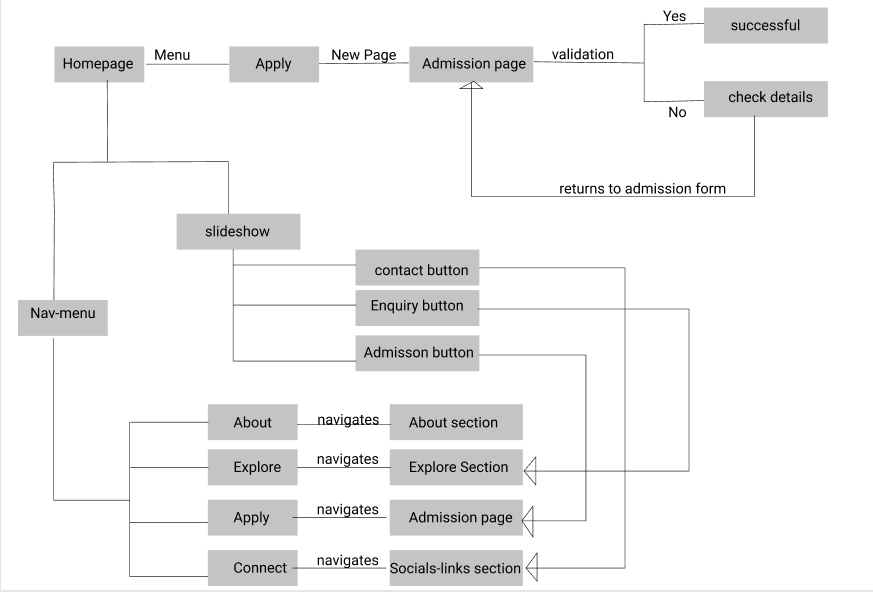

# school-website
# A SCHOOL WEBSITE DESIGNED USING HTML, CSS & JS

## Introduction

A simple school respondive website designed using HTML,CSS & JAVASCRIPT.The client is responsible for maintaining the content; adding new content and changing elements of the visual design, The visitor to the site cannot make these changes but accesses the site to read the content. It is simple and efficient responsive site which can be accessed everywhere.

## <b>Technologies used:</b>

-HTML 

-CSS

-Bootstrap

-Javascript

# References of used code

## HTML Reference links

[HTML Reference link-1](https://www.w3schools.com/html "HTML")

[HTML Reference link-2](https://developer.mozilla.org/en-US/docs/Web/HTML "HTML")

## CSS Refrence links

[CSS Reference link-1](https://www.w3schools.com/w3css/defaulT.asp " CSS")

[CSS Reference link-2](https://developer.mozilla.org/en-US/docs/Web/CSS " CSS")

## Bootstrap Reference links
[Bootstrap Reference link-1](https://getbootstrap.com/ "Bootstrap")

[Bootstrap Reference link-2](w3schools.com/bootstrap/"Bootstrap")

## Javascript Reference links

[Javascript Reference link-1](https://www.w3schools.com/js/DEFAULT.asp "Javascript")

[Javascript Reference link-2](https://javascript.info/ "Javascript")

# Flow and key features:

